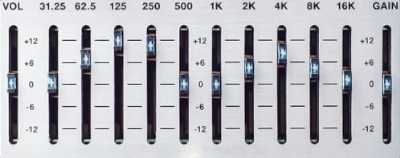

# Introduction

In this guide, you will learn how to improve the sound of your headphones for free by tuning them towards the Harman target curve. Along the way, you will also learn about equalization in general, and – hopefully – enrich your hobby by developing a better understanding of audio gear and sound-related software. If you want to skip the theory and jump right into the guide, click [here](https://komunikacjatechnicznavistula.github.io/kacper-bojakowski/manual/step-by-step-guide/).

## Table of contents

* <a style="pointer-events: none;" href="https://komunikacjatechnicznavistula.github.io/kacper-bojakowski/#introduction" alt="Introduction">Introduction</a> ← You are here!
* [Theory](https://komunikacjatechnicznavistula.github.io/kacper-bojakowski/theory/#theory)
    * [Harman target](https://komunikacjatechnicznavistula.github.io/kacper-bojakowski/theory/harman-target/#harman-target)
    * [Equalization](https://komunikacjatechnicznavistula.github.io/kacper-bojakowski/theory/Equalization/#equalization)
       * [What is equalization?](https://komunikacjatechnicznavistula.github.io/kacper-bojakowski/theory/Equalization/what-equalization/#what-is-equalization)
       * [Why would I want to equalize?](https://komunikacjatechnicznavistula.github.io/kacper-bojakowski/theory/Equalization/why-equalize/#why-would-i-want-to-equalize)
       * [Why don't headphones come already equalized?](https://komunikacjatechnicznavistula.github.io/kacper-bojakowski/theory/Equalization/why-produce/#why-dont-manufacturers-produce-already-equalized-heaphones)
       * [Won't equalization distort the sound?](https://komunikacjatechnicznavistula.github.io/kacper-bojakowski/theory/Equalization/will-distort/#wont-equalization-distort-the-sound)
       * [How to do this properly?](https://komunikacjatechnicznavistula.github.io/kacper-bojakowski/theory/Equalization/how-properly/#how-to-do-this-properly)
* [Manual]()
    * [**Step-by-step guide**](https://komunikacjatechnicznavistula.github.io/kacper-bojakowski/manual/step-by-step-guide/)
    * [Troubleshooting](https://komunikacjatechnicznavistula.github.io/kacper-bojakowski/manual/troubleshooting/)
       * [I can only set values with accuracy to 0.5.](https://komunikacjatechnicznavistula.github.io/kacper-bojakowski/manual/troubleshooting/values-accuracy/#i-can-only-set-values-with-accuracy-to-05)
       * [I can't hear the difference when I click "ON/OFF".](https://komunikacjatechnicznavistula.github.io/kacper-bojakowski/manual/troubleshooting/difference-click/#i-cant-hear-the-difference-when-i-click-onoff)
       * [The volume seems lower after equalization.](https://komunikacjatechnicznavistula.github.io/kacper-bojakowski/manual/troubleshooting/volume-lower/#the-volume-is-lower-when-i-turn-on-the-equalization)
       * [I don't like the sound after equalization.](https://komunikacjatechnicznavistula.github.io/kacper-bojakowski/manual/troubleshooting/dislike-sound/#i-have-set-it-all-right-but-i-dont-like-the-way-it-sounds)
       * [How can I make this work on a Mac?](https://komunikacjatechnicznavistula.github.io/kacper-bojakowski/manual/troubleshooting/work-mac/#how-can-i-make-this-work-on-a-mac)
* [Glossary](https://komunikacjatechnicznavistula.github.io/kacper-bojakowski/glossary/)
* [Links](https://komunikacjatechnicznavistula.github.io/kacper-bojakowski/links/)

---

*Next section: [Theory](https://komunikacjatechnicznavistula.github.io/kacper-bojakowski/theory/)*
